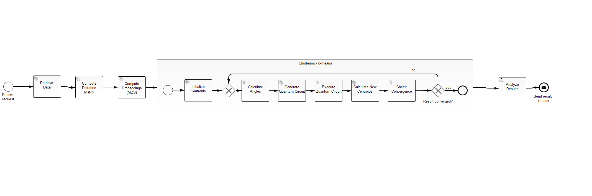

# Scenario 3 - Clustering Workflow

The following figure shows the workflow model implementing the clustering use case from scenario 3:



## Setting up the Environment

All required services, as well as the workflow engine, are dockerized and can be automatically set up using Docker-Compose:

1. Update the [.env](./docker/.env) file with your settings: 
  * ``PUBLIC_HOSTNAME``: Enter the hostname/IP address of your Docker engine. Do *not* use ``localhost``.

2. Run the Docker-Compose file:
```
docker-compose pull
docker-compose up --build
```

3. Wait until all containers are up and running. This may take some minutes.

## Running the Workflow

To execute the workflow, open ``$PUBLIC_HOSTNAME:8080`` after all Docker containers have been started successfully to access the Camunda Engine UI:

1. Create a new user and login.

2. Open the ``Tasklist`` application which can be accessed by using the button in the top-right corner.

3. Click on ``Start process`` and select the ``quantum-workflow-demonstrator``.

4. Provide the required input data, i.e., (i) your IBMQ access token, (ii) the QPU to use (e.g., ``ibmq_qasm_simulator``), and (iii) the URL to load the input data from, which can be found in [this folder](./data) (e.g., ``https://raw.githubusercontent.com/vietzd/qc-cloud-challenges/main/scenario3/data/Subset25.csv)

5. Start the workflow.

6. Switch to the ``Cockpit`` application to monitor the token flow and the current variables of the workflow instance.

7. Once the workflow instance reaches the final User Task, switch back to the ``Tasklist`` application and click on ``Add a simple filter`` on the left.

8. Afterwards, a task object is displayed. Select this task object and retrieve the final clustering results, i.e., the calculated centroids.

9. Finally, click on ``Complete`` to terminate the workflow instance.

10. To shut down the setup, run ``docker-compose down -v`` in the folder containing the Docker-Compose file.

**Note**: This use case is adapted from [this implementation](https://github.com/UST-QuAntiL/QuantME-UseCases/tree/master/2021-icws).
